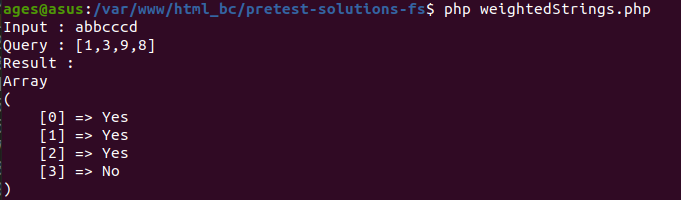
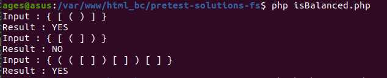
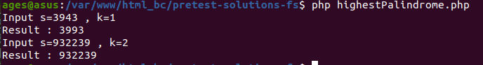

# Pretest solution

Proyek ini terdiri dari tiga tugas utama yang dipecahkan melalui tiga fungsi. Setiap tugas memiliki tujuan dan aturan tersendiri yang dijelaskan di bawah ini. Semua fungsi ditulis dalam bahasa pemrograman PHP dan difokuskan pada pemecahan masalah berbasis string dan rekursi.

## 1. Weighted Strings

### Deskripsi
Setiap huruf dalam alfabet, dari 'a' hingga 'z', diberikan bobot sesuai dengan posisi ordinalnya. Misalnya, 'a' memiliki bobot 1, 'b' memiliki bobot 2, dan seterusnya, dengan 'z' memiliki bobot 26. Bobot dari sebuah string dihitung dengan menjumlahkan bobot dari semua karakternya.

### Contoh
- **Input**: String "abbcccd" dan array queries "[1, 3, 9, 8]"
- **Output**: ["Yes", "Yes", "Yes", "No"]
- **Penjelasan**:
  - Bobot karakter: a = 1, b = 2, bb = 4, c = 3, cc = 6, ccc = 9, d = 4
  - 1 => Yes, 3 => Yes, 9 => Yes, 8 => No

- Hasil Screenshoot Test

### Aturan
1. Jika sebuah angka dalam queries sama dengan bobot karakter atau substring, keluarkan "Yes".
2. Jika sebuah angka dalam queries berbeda dari bobot karakter atau substring, keluarkan "No".
3. Untuk karakter yang berulang dan berurutan, bobot harus ditentukan untuk setiap substring dari kemunculan pertama hingga kemunculan ke-n.

### Fungsi
- **weightedStrings($string, $queries)**: Fungsi untuk menentukan status dari angka-angka dalam queries berdasarkan bobot karakter dan substring dalam string.

## 2. Balanced Brackets

### Deskripsi
Menentukan apakah string dari tanda kurung seimbang adalah masalah dasar dalam ilmu komputer, terutama dalam parsing dan validasi ekspresi. String tanda kurung yang seimbang terdiri dari pasangan tanda kurung pembuka dan penutup, di mana setiap tanda kurung pembuka memiliki tanda kurung penutup yang sesuai, dan tanda kurung bersarang dengan benar.

### Contoh
- **Input**: "{ [ ( ) ] }"
- **Output**: "YES"
- **Penjelasan**: Setiap tanda kurung seimbang, dengan setiap tanda kurung pembuka memiliki tanda kurung penutup yang sesuai.

- Hasil Screenshoot Test

### Aturan
1. Jenis tanda kurung yang diizinkan: ( , ) , { , } , atau [ , ].
2. Tanda kurung dapat dipisahkan dengan atau tanpa spasi.
3. Periksa pasangan tanda kurung pembuka dan penutup yang sesuai dan keluarkan string "YES" atau "NO" sesuai.

### Fungsi
- **balancedBrackets($string)**: Fungsi untuk menentukan apakah string tanda kurung seimbang.

## 3. Highest Palindrome

### Deskripsi
Diberikan string yang mewakili angka, tujuan adalah untuk menemukan palindrom tertinggi yang dapat dibentuk dengan mengubah maksimal `k` digit dalam string tersebut. Sebuah palindrom adalah angka yang dibaca sama dari depan maupun belakang.

### Contoh
- **Input**:
  - String: "3943"
  - k: 1
- **Output**: "3993"
- **Penjelasan**: Di antara palindrom yang mungkin terbentuk, palindrom tertinggi adalah "3993" karena "3993 > 3443".

- Hasil Screenshoot Test

### Aturan
1. Jika palindrom tidak dapat dibentuk dari string yang diberikan meskipun setelah `k` penggantian, dan string tersebut tidak mewakili angka yang valid, keluarkan `-1`.
2. Tidak menggunakan fungsi bawaan atau alat untuk pencarian, penyaringan, atau pengurutan.
3. Hindari penggunaan loop.
4. Hanya menggunakan rekursi untuk menyelesaikan masalah.

### Fungsi
- **highestPalindrome($s, $k)**: Fungsi rekursif untuk menemukan palindrom tertinggi yang dapat dibentuk dengan mengubah maksimal `k` digit.

## Kompleksitas
### Kompleksitas Waktu
- **Weighted Strings**: `O(n * m)`, di mana `n` adalah panjang string dan `m` adalah panjang queries.
- **Balanced Brackets**: `O(n)`, di mana `n` adalah panjang string.
- **Highest Palindrome**: `O(n)`, di mana `n` adalah panjang string.

### Kompleksitas Ruang
- **Weighted Strings**: `O(1)`, hanya menggunakan ruang tetap.
- **Balanced Brackets**: `O(n)`, untuk stack yang digunakan dalam pemeriksaan tanda kurung.
- **Highest Palindrome**: `O(n)`, untuk rekursi dan perubahan yang dilacak.

## Cara Penggunaan
- Pastikan PHP terinstal di sistem Anda.
- Jalankan setiap fungsi dengan memberikan parameter yang sesuai.
- Periksa output sesuai dengan contoh dan aturan yang telah diberikan.